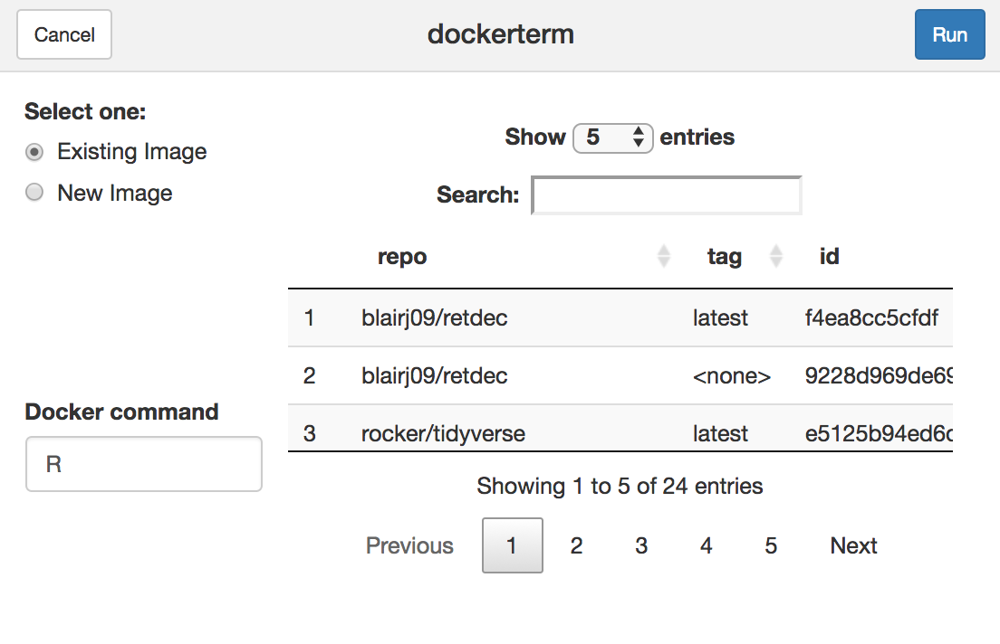

Recently I've been using [Docker](https://www.docker.com) a lot more with various projects I'm working on. I've always liked the idea of Docker, but as I've become more familiar with it I've started to really appreciate its magic. As a "way too brief" overview, Docker provides a convenient way to manage system dependencies by creating lightweight virtual environments known as containers. The use cases for these containers are limitless, but in the context of what I've been doing I've mainly been using Docker in connection with [R](https://www.r-project.org). This motivated me to explore what a connection between RStudio and Docker might look like. Essentially, I wanted a way to run R code from RStudio within a Docker container.

Now, before I get too far into this, it's essential to note that RStudio Server plays very nicely with Docker and the combination of the two can provide the functionality I'm referencing. In fact, the [Rocker Project](https://www.rocker-project.org) maintains excellent Docker images with various R and RStudio product configurations. When using Docker with RStudio Server, the Docker container acts as the server supporting R and the port used by RStudio Server is mapped to a port on the host machine. After properly starting a Docker container with RStudio server (ie `docker run --rm -p 8787:8787 rocker/rstudio`) a user simply needs to visit `localhost:8787` in a browser on their machine to have access to RStudio and an r session running within the container. This is a workflow I use often. However, there are times when it would be nice to stay in my local version of RStudio and run code that I'm working on against a Docker container, which is how `dockerterm` was born.

## Framework
As I thought about what I wanted to accomplish, an [RStudio Addin](https://rstudio.github.io/rstudio-extensions/rstudio_addins.html) seemed like the natural mechanism. The recent addition of the [terminal pane](https://support.rstudio.com/hc/en-us/articles/115010737148-Using-the-RStudio-Terminal#send) to RStudio also seemed like a naturl fit, especially since commands can be sent directly from an RStudio source pane to the termianl with `CTRL/CMD + ALT + ENTER`. The initial idea was to create an RStudio Addin that enabled a user to start a new Docker container based on a specified image that would run in the RStudio terminal. The user could interact with the "remote" R session by sending code from source files via the previously mentioned key combination.

## Build
Once I had a loose concept, I started exploring how to make a working proof of concept. First, I needed someway to manipulate the RStudio terminal pane. Enter the [`rstudioapi`](https://github.com/rstudio/rstudioapi) package, which provides useful functions for safely interacting with RStudio through R code. For this project, I found the functions pre-pended with `terminal` to be most helpful for manipulating the terminal pane and executing terminal commands.

Once I could programatically manipulate the terminal pane, I needed a way to start up a Docker container running in the terminal. This can be simply accomplished using the Docker CLI and passing the appropriate options to `docker run`. I considered using the [`docker`](https://github.com/bhaskarvk/docker) R package, but hesitated to introduce a dependency on python. However, I may move in this direction in the future.

Now I just needed a way to allow the user to specify the image for the Docker container. To accomplish this, I created a simple [`shiny`](https://shiny.rstudio.com) application using [`miniUI`](https://github.com/rstudio/miniUI) (a shiny framework designed for RStudio Addin gadgets) that allows a user to select from an existing group of Docker images or to specify an image to download and run from [Docker Hub](https://hub.docker.com). Users can also specify which command is run within the container, with the default set to `R`.

Once the user makes their selections and clicks on Run, a new terminal is created and the docker container is attached to that window. If `R` was passed in as the command, the container starts an r session that the user can interact with as previously mentioned.

## PoC Performance

## Limitations

## What's Next